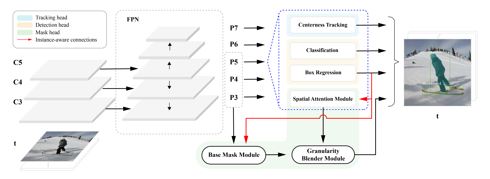

# SG-Net: Spatial Granularity Network for One-Stage Video Instance Segmentation

    

## Introduction
We approach the [[VIS task]](https://youtube-vos.org/dataset/vis)  from a new perspective and propose a one-stage spatial granularity network (SG-Net) (as shown in the above figure). This repo is the implementation of CVPR 2021 paper "SG-Net: Spatial Granularity Network for One-Stage Video Instance Segmentation."
 [[pdf](https://github.com/goodproj13/SG-Net)] 
 

## Installation

Please find detailed steps [Here](docs/INSTALL.md) for installation and dataset preparation.

## Train

Please find details [Here](docs/REPRODUCTION.md) for step-by-step instructions.

## Inference

Please refer to [Here](docs/INFERENCE.md) for inference.

## TODO List
- [x] Baseline model code release
- [ ] Pretrained weights for baseline model
- [ ] Full mode code release
- [ ] Pretrained weights for full model

## License

`SG-Net` is released under the MIT license.

## Acknowledgements
We truely thanksful of the following piror efforts in terms of knowledge contributions and open-source repos. 
+ BlendMask: Top-down meets bottom-up for instance segmentation (CVPR'20) [[paper]](https://openaccess.thecvf.com/content_CVPR_2020/papers/Chen_BlendMask_Top-Down_Meets_Bottom-Up_for_Instance_Segmentation_CVPR_2020_paper.pdf) [[official code]](https://github.com/aim-uofa/AdelaiDet/tree/master/configs/BlendMask)
+ Video Instance Segmenation (ICCV'19) [[paper]](https://openaccess.thecvf.com/content_ICCV_2019/papers/Yang_Video_Instance_Segmentation_ICCV_2019_paper.pdf) [[official code]](https://github.com/youtubevos/MaskTrackRCNN) 
