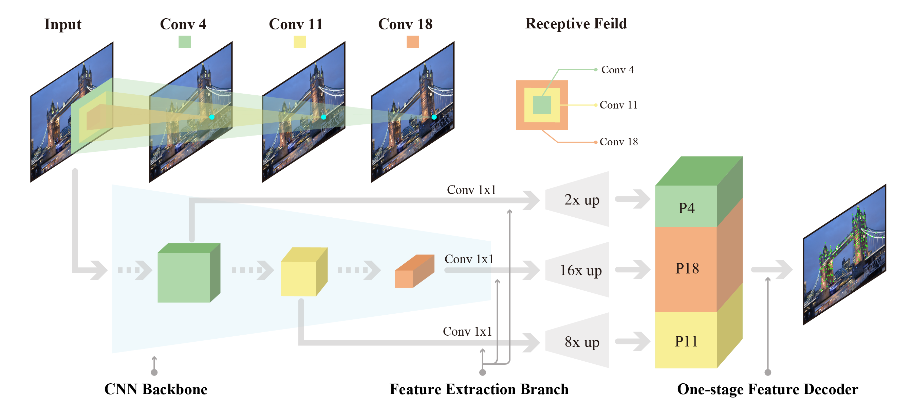

# DenserNet: Weakly Supervised Visual Localization Using Multi-scale Feature Aggregation 

<p align="center">
    
</p>

## Introduction

`DenserNet` uses multiple-semantics fusion for image-based localization (as shown in the above figure), which leverages the image-level supervision (positive and negative image pairs) without feature correspondences. This repo is the PyTorch implementation of AAAI2021 paper "DenserNet: Weakly Supervised Visual Localization Using Multi-scale Feature Aggregation."
 [[pdf](https://arxiv.org/abs/2012.02366)] [[project page](https://yimingcuicuicui.github.io/DenserNet/)]

## Installation

Please find detailed steps [Here](docs/INSTALL.md) for installation and dataset preparation.

## Train & Test

Please find details [Here](docs/REPRODUCTION.md) for step-by-step instructions.

## Model Zoo

Please refer to [Here](docs/MODEL_ZOO.md) for trained models.

## Inference on a single image 

Please refer to [Here](docs/INFERENCE.md) for inference on a single image.

## Train on customized dataset
Please refer to [Here](docs/INSTALL.md#use-custom-dataset-optional) to prepare your own dataset.

## License

`DenserNet` is released under the MIT license.


## Citation

If you find this repo useful for your research, please consider citing the paper
```
@inproceedings{liu2020densernet,
    title={DenserNet: Weakly Supervised Visual Localization Using Multi-scale Feature Aggregation},
    author={Dongfang Liu, Yiming Cui, Liqi Yan, Christos Mousas, Baijian Yang, Yingjie Chen},
    booktitle={AAAI}
    year={2021},
}
```

## Acknowledgements
We truely thanksful of the following piror efforts in terms of knowledge contributions and open-source repos. Particularly, "ASLFeat" has a similar approach to ours but using strong supervision.
+ NetVLAD: CNN architecture for weakly supervised place recognition (CVPR'16) [[paper]](https://arxiv.org/abs/1511.07247) [[official code (pytorch-NetVlad)]](https://github.com/Nanne/pytorch-NetVlad)
+ SARE: Stochastic Attraction-Repulsion Embedding for Large Scale Image Localization (ICCV'19) [[paper]](https://arxiv.org/abs/1808.08779) [[official code (MatConvNet)]](https://github.com/Liumouliu/deepIBL) 
+ ASLFeat: Learning Local Features of Accurate Shape and Localization (CVPR'20) [[paper]](https://arxiv.org/abs/2003.10071) [[official code]](https://github.com/lzx551402/ASLFeat)